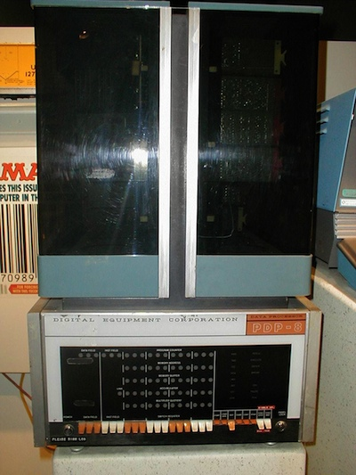
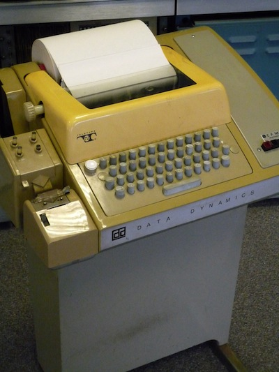
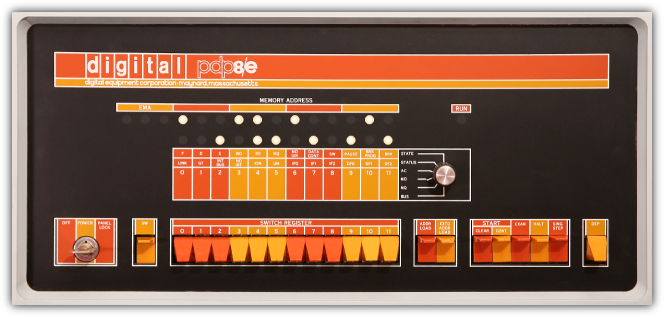

% DEC PDP-8: History and Design
% Jeremy Chalmer
% 2011-12-14

# DEC PDP-8 #

# DEC History #

* Founded 1957 by Ken Olson, Harlan Anderson
* Located in Maynard, MA (until 1992)
* Created PDP, VAX families of Minicomputers
* Created Alpha Workstations
* Created VT100 Terminal
* At its peak, employed over 140,000
* Eventually acquired by Compaq (1998), then HP.

# PDP Family #

* Programmable Data Processor
* Inexpensive Minicomputer ($120,000 instead of $1.2 Million)
* Began with PDP-1 - 18-bit word size, ~200 Kilohertz Clock Speed
    * First computerized video game: Spacewar!
    * First Text Editor, Word Processor
* PDP-4, PDP-5, PDP-7 (Original Unix Machine)

# PDP8 #

* Introduced March 22, 1965
* First commercially successful Minicomputer
* Over 50,000 systems sold - more then any other minicomputer to date.
* Original price $18,000 (1/5 cost of IBM/360)

# Hardware #

* CPU with 4K of Memory (4,096 twelve-bit words)
* Teletype interface: ASR-33 Teletype
* Programmed I/O Bus (Negibus) - Printers / Teletypes
* DMA Bus - ADs, DAs, Tape, Disk Drives

# PDP-8 Software #

* Original Model had 8 Instructions, 2 Registers, Magnetic Core memory
* No 'Operating System' originally - just raw opcode entry via switches.
* Moved on to Paper Tape 'Operating Systems' - single function programs stored on Paper Tape (PAL or FORTRAN Compiler/Runtime)
* Eventually more complex operating systems evolved, such as OS/8.

# PDP-8 Instructions #

* 12-bit Instruction Words
    * 0-2 - Instruction Code
    * 3 - Indirection Bit
    * 4 - Use Program Counter to complete Address
    * 5-11 - Offset (Used for 7-bit addresses or OPR Codes)
* 4096 word memory, divided into 128-word 'pages'.
* Routines had to fit within 128 words of memory
* Assembler Instructions:
    * 000 – AND – AND the memory operand with AC.
    * 001 – TAD – Two's complement ADd the memory operand to <L,AC> (a 13 bit signed value).
    * 010 – ISZ – Increment the memory operand and Skip next instruction if result is Zero.
    * 011 – DCA – Deposit AC into the memory operand and Clear AC.
    * 100 – JMS – JuMp to Subroutine (storing return address in first word of subroutine!).
    * 101 – JMP – JuMP.
    * 110 – IOT – Input/Output Transfer.
    * 111 – OPR – microcoded OPeRations.

# OPR Instruction #

* Special instruction used for program control, not containing a memory address.
* 'Microcoded' - One OPR Word could contain several instructions (basically a bitfield).
* Instructions for Setting, Clearing and modifying the Accumulator and registers
* Also used for arithmetic operations. 

# Assembler Examples #

    *10                   / Set current assembly origin to address 10,
    STPTR,    STRNG-1     / An auto-increment register (one of eight at 10-17)
    
    *200                  / Set current assembly origin to program text area
    HELLO,  CLA CLL       / Clear AC and Link again (needed when we loop back from tls)
            TAD I Z STPTR / Get next character, indirect via PRE-auto-increment address from the zero page
            SNA           / Skip if non-zero (not end of string)
            HLT           / Else halt on zero (end of string)
            TLS           / Output the character in the AC to the teleprinter
            TSF           / Skip if teleprinter ready for character
            JMP .-1       / Else jump back and try again
            JMP HELLO     / Jump back for the next character
    
    STRNG,  310           / H
            345           / e
            354           / l
            354           / l
            357           / o
            254           /,
            240           / (space)
            367           / w
            357           / o
            362           / r
            354           / l
            344           / d
            241           / !
            0             / End of string
    $HELLO                /DEFAULT TERMINATOR

# Historical Relevance #

* Large family of PDP-8 Models were produced, using different internal designs.
* Eventual sales across all models topped 300,000.
* Had a vast number of peripheral devices (Storage, I/O, control, memory)
* Eventually supplanted by microcomputers - and faded out by the introduction of the IBM PC.
* 

# References #

* [http://www.faqs.org/faqs/dec-faq/pdp8/](http://www.faqs.org/faqs/dec-faq/pdp8/)
* [http://www.divms.uiowa.edu/\~jones/pdp8/](http://www.divms.uiowa.edu/~jones/pdp8/)
* [http://www.grc.com/pdp-8/pdp-8.htm](http://www.grc.com/pdp-8/pdp-8.htm)
* [http://www.pdp8online.com/](http://www.pdp8online.com/)